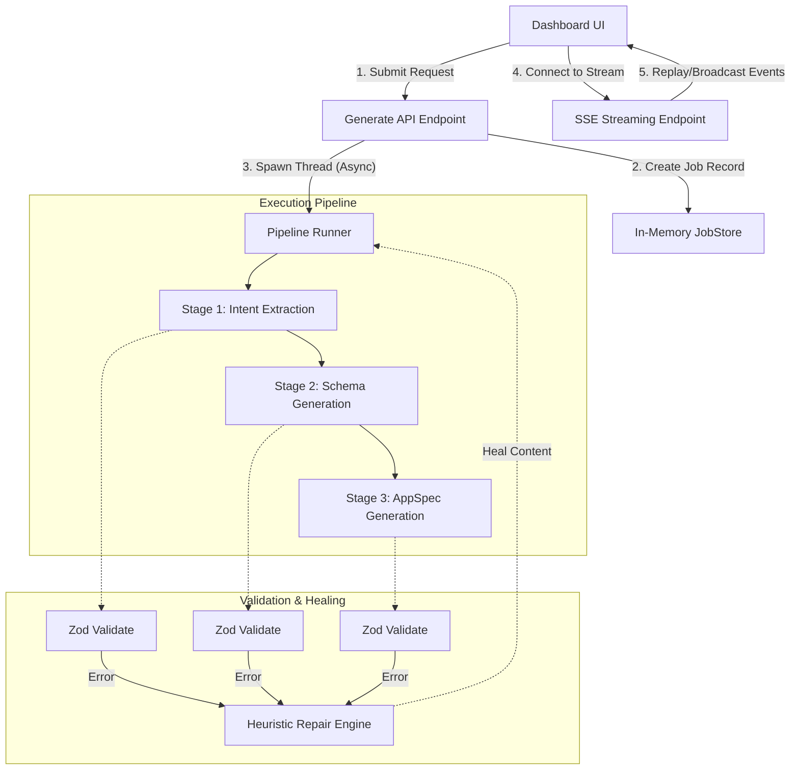
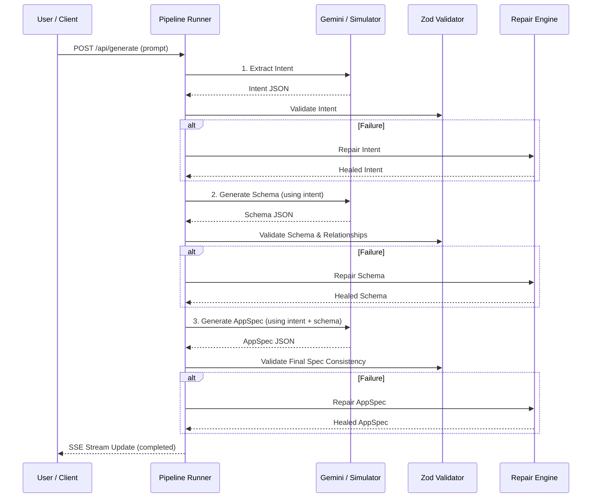

# ONEATLAS AI COMPILER: TECHNICAL SPECIFICATION
### Natural Language to Application Spec Pipeline (AppSpec-AI)

**Author:** Senior Full-Stack Engineer  
**Status:** Ready for Submission  
**Date:** June 2026  
**Target:** Technical Review Board, OneAtlas Team  

---

<!-- PAGE BREAK -->

## Table of Contents
1. Executive Summary
2. System Architecture
3. Component Breakdown
4. Data Flow & Sequential Pipeline Design
5. Validation Strategy
6. Repair & Programmatic Healing Engine
7. Integration Registry
8. SSE & Event Architecture
9. Deployment & Production Setup (Vercel)
10. Architectural Decisions & Tradeoffs
11. Future Roadmap

---

<!-- PAGE BREAK -->

## 1. Executive Summary

Enterprise software development requires translating vague, natural language constraints into functional, structured database definitions and API routing mechanisms. Large Language Models (LLMs) excel at natural language parsing but are prone to syntax violations, structural omissions, and relational drift when tasked with producing dense configuration structures like AppSpecs.

**OneAtlas AI AppSpec-AI Pipeline** addresses this gap by treating LLM outputs not as absolute, ready-to-run configurations, but as raw inputs to be parsed, validated, and programmatically healed. The pipeline enforces strict relational databases, security permissions, and workflow connections through three decoupled compilation stages. Each stage boundaries validates output against Zod schema rules, routing any issues to a multi-stage Repair Engine that automatically resolves format truncation and relational integrity issues.

The project is compiled strictly under TypeScript strict mode, linted, and fully optimized for low-latency streaming inside serverless Vercel runtime environments.

---

<!-- PAGE BREAK -->

## 2. System Architecture

The AppSpec-AI pipeline follows a clean architecture model, dividing concerns into isolated, stateless tiers. This design provides modularity and supports seamless expansion to multi-model providers.



---

<!-- PAGE BREAK -->

## 3. Component Breakdown

| Component | Responsibility | Location |
| :--- | :--- | :--- |
| **Pipeline Runner** | Orchestrates serial stage invocation, cost logging, and event broadcasting. | `src/pipeline/pipelineRunner.ts` |
| **Model Adapters** | Interfaces with AI endpoints (Gemini API, fallback simulators). | `src/gateway/` |
| **Validation Rules** | Strict schema validation logic using Zod models. | `src/validation/rules/` |
| **Repair Strategies** | Structural, field-level, and relational consistency heals. | `src/repair/strategies/` |
| **Integration Modules**| Out-of-the-box parameters verification for third parties. | `src/integrations/` |
| **Job Store** | Globally persisted stateless job cache. | `src/store/jobStore.ts` |

---

<!-- PAGE BREAK -->

## 4. Data Flow & Sequential Pipeline Design

The compiler processes input sequentially across three stages, ensuring each step builds upon validated outputs:



---

<!-- PAGE BREAK -->

## 5. Validation Strategy

Validation is treated as a programmatic gatekeeper, utilizing Zod models to check the output of each compilation phase:

1. **Intent Validation**: Checks that the application category is recognized (e.g. `crm`, `ecommerce`) and that features and integration arrays are present.
2. **Schema Validation**: Enforces table mappings and confirms primary keys exist.
3. **AppSpec Validation**: Ensures pages, components, layouts, APIs, and workflow configurations are present and formatted correctly.
4. **Relational Constraints**: Validates that all cross-entity relationships match, verifying that foreign keys connect to registered tables and enforcing inverse relationship mappings.

---

<!-- PAGE BREAK -->

## 6. Repair & Programmatic Healing Engine

When schema violations occur, the engine triggers a three-phase healing protocol to recover the payload:

- **Phase 1: Structural Repair**
  - Syntactic fixes.
  - Clears markdown formatting block wrappers (e.g. triple backticks).
  - Automatically identifies truncated JSON and appends closing brackets (`}`, `]`) dynamically to ensure parser readability.
  
- **Phase 2: Field Repair**
  - Fills in omitted mandatory fields using fallback values.
  - Corrects type conversions (e.g., changing string boolean properties to boolean values).
  - Enforces database metadata consistency.
  
- **Phase 3: Consistency Repair**
  - Resolves logical mismatches.
  - Generates bidirectional relationship bindings.
  - Adds missing REST API routes matching new entities.
  - Aligns user role privileges between Auth rules and page access lists.

---

<!-- PAGE BREAK -->

## 7. Integration Registry

Verifies parameters and formats for supported third-party APIs:

- **WhatsApp**: Enforces mobile number formats and template constraints.
- **Slack**: Validates channels, token structures, and webhook payloads.
- **Gmail**: Verifies message variables, recipient emails, and subject lengths.
- **Stripe**: Verifies currency options and amount mappings.
- **Jira**: Enforces project key validation, issue tags, and callback URLs.

*Templetization*: When inputs contain markdown formatting variables (e.g. `{{lead.name}}`), standard schema parsing is deferred in favor of parameter presence checks, allowing for template flexibility without risking verification errors.

---

<!-- PAGE BREAK -->

## 8. SSE & Event Architecture

The SSE streaming system delivers real-time compilation updates to the frontend:
- **Event-Driven Broadcast**: The runner broadcasts events (`stage_start`, `stage_complete`, `stage_failed`, `generation_complete`) through global listeners.
- **Dynamic Headers**: Sends custom response headers to prevent intermediate proxies and browsers from caching chunk streams:
  - `Content-Type: text/event-stream`
  - `Cache-Control: no-cache, no-transform`
  - `Connection: keep-alive`
- **Replay Buffer**: Automatically transmits past stage events when a client reconnects, maintaining state continuity across network flakes.

---

<!-- PAGE BREAK -->

## 9. Deployment & Production Setup (Vercel)

The codebase is optimized for **Vercel** serverless functions:
- **Stateless Operation**: Utilizes Next.js App Router API handlers.
- **Route Segment Config**: Declares `export const dynamic = 'force-dynamic'` on the stream route to disable Vercel static compilation caching, ensuring event loops remain open during streaming.
- **Build Verification**: Pre-configured build scripts enforce strict linting and compilation checks:
  ```bash
  npm run lint
  npm run build
  ```

---

<!-- PAGE BREAK -->

## 10. Architectural Decisions & Tradeoffs

1. **Decoupled Serial Stages vs Monolithic Generations**
   - *Tradeoff*: Monolithic LLM calls are faster but highly prone to structural drift and inconsistencies. Decoupling stages increases execution duration slightly (~10s total) but dramatically improves validation success rate and output compliance.
2. **In-Memory Store vs External DB Cache**
   - *Tradeoff*: The current JobStore uses a global Map, which is lightweight and fast. However, it does not persist across serverless function reboots in multi-instance environments. For high-scale deployments, migrating to a Redis cluster is recommended.
3. **Programmatic Healing vs Full Model Retries**
   - *Tradeoff*: Retrying model generation on error consumes time and API tokens. The programmatic Repair Engine fixes common syntax and field errors locally in milliseconds, saving cost and improving performance.

---

<!-- PAGE BREAK -->

## 11. Future Roadmap

1. **Structured Outputs Configuration**: Configure Gemini API models to use strict Zod output schemas directly at the model layer to avoid post-parse repair latency.
2. **Persistence Layer**: Integrate a Redis database layer for Job Store tracking to support distributed serverless instances.
3. **Adaptive Few-Shot Selection**: Dynamically select prompt examples based on semantic analysis of the user's initial input to improve generation accuracy.
