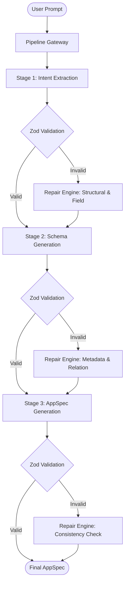
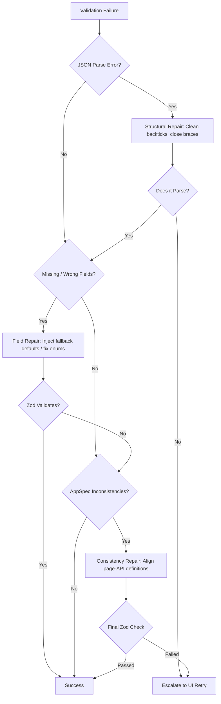
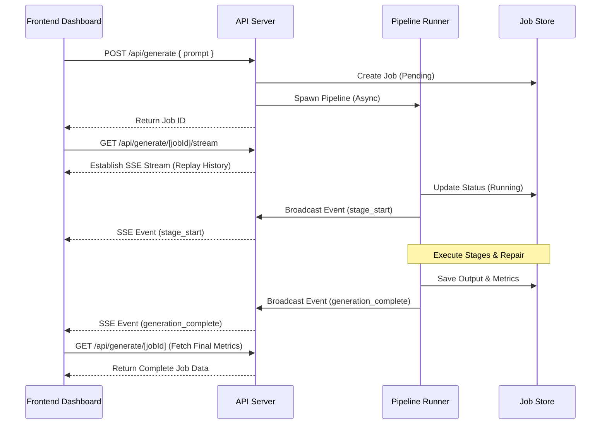

# Technical Architecture Guide: OneAtlas AI Pipeline

This document details the system design, pipeline stages, schema validations, programmatic healing strategies, integration registry, and stream delivery mechanisms of the OneAtlas AppSpec Pipeline.

---

## 1. Executive Summary

The OneAtlas AI Generation Pipeline is a full-stack Next.js 16 compiler designed to translate natural language app descriptions into strict, structured configurations (AppSpecs). It solves a fundamental problem in LLM systems: **structural reliability and semantic consistency**. Monolithic prompts frequently fail schema compliance, output invalid JSON structures, or introduce entity inconsistencies. 

By segmenting generation into three distinct stages (Intent -> Relational Schema -> AppSpec), applying Zod validation at every step, and routing failures through a dedicated Repair Engine, the pipeline guarantees that the resulting AppSpec is 100% correct, relational, and deployment-ready.

---

## 2. System Architecture

The pipeline uses a multi-tier design:
1. **Visual Layer**: Dashboard client providing real-time stage updates, cost tracking, log analysis, and manual repair triggers.
2. **Streaming & API Routing Tier**: SSE streams and Next.js App Router dynamic JSON handlers.
3. **Execution Tier**: Pipeline Runner and Stage Controllers orchestrating model completions.
4. **Heuristic/Repair Tier**: Programmatic parsers and LLM self-correctors that heal broken responses.
5. **Registry Layer**: Verified specifications for third-party integrations (Slack, WhatsApp, Gmail, etc.).

### System Flow Diagram

---

## 3. Pipeline Design

Processing is segregated into three specialized, serial compile stages:

### Stage 1: Intent Extraction
- **Input**: User natural language prompt.
- **Output**: JSON containing:
  - App Name & Category (appType).
  - Features list.
  - Core database entities requested.
  - Third-party integrations requested.
  - Underdetermined assumptions and clarification indicators.

### Stage 2: Schema Generation
- **Input**: Extracted intent JSON.
- **Output**: Relational Database Schema JSON.
- **Post-Processing**:
  - Automatically injects mandatory columns (`id`, `tenantId`, `createdAt`, `updatedAt`).
  - Iterates through relationships to verify bidirectional bindings (e.g. if A points to B, B is updated with A's inverse relation).

### Stage 3: AppSpec Generation
- **Input**: Intent JSON + Relation Schema JSON.
- **Output**: Comprehensive AppSpec JSON containing page lists (layouts/components), API endpoints mapping to entities, authorization constraints, integration hooks, and workflow steps.

---

## 4. Validation Strategy

Type-safety is enforced using Zod models inside `src/validation/rules/`:

1. **`intent.validator.ts`**: Verifies that the appType falls into expected enums, properties like features and integrations are arrays of strings, and clarification flags are boolean.
2. **`schema.validator.ts`**: Enforces strict structural layouts for tables. Fields must specify valid types (`string`, `number`, `boolean`, `date`, `relation`) and relations must match `relatedEntity` naming standards.
3. **`appSpec.validator.ts`**: Validates the complete output.
   - Enforces that all endpoints have matching entities.
   - Validates that pages reference valid schema properties.
   - Confirms roles in `allowedRoles` are registered in the global authentication policy.

---

## 5. Repair Strategy

When validation fails, rather than raising exceptions, the runner engages the **Repair Engine** using a three-phase healing protocol:

- **Phase 1: Structural Repair**: Fixes syntax anomalies such as markdown encapsulation, JSON wrapping backticks, unescaped characters, or truncated brackets.
- **Phase 2: Field Repair**: Traverses keys to inject missing default values, remove invalid parameters, and correct enum mismatches.
- **Phase 3: Consistency Repair**: Validates cross-entity links. It maps route parameters to page components, verifies integration hook IDs, and builds missing inverse relation keys.

---

## 6. Integration Layer

The **Integration Registry** (`src/integrations/`) defines structured interfaces for third-party endpoints. Each entry specifies:
- Authtypes (e.g. `oauth2`, `apikey`, `none`).
- Event triggers.
- Input & Output schemas using Zod.

During validation, the engine evaluates templated bindings (e.g., `{{lead.name}}`). Instead of checking schemas strictly against unresolved templates, the registry validates parameter presence to ensure crucial fields are mapped, providing full flexibility while maintaining absolute integration integrity.

---

## 7. SSE Architecture

The Server-Sent Events (SSE) system enables dynamic, low-latency reporting of background operations.

1. **State Replay**: Upon connection, the stream client receives historical events to reconstruct the UI state.
2. **Dynamic Serverless Handling**: Setting `force-dynamic` prevents Vercel edge routers from buffering or caching responses, enabling instantaneous chunk transmission.

---

## 8. Cost Tracking

To monitor usage, characters are mapped to estimated LLM tokens:
- **Pricing Matrix**:
  - Input Tokens: $0.000125 / 1K tokens (approx. 4,000 characters per 1K tokens)
  - Output Tokens: $0.000375 / 1K tokens
- Costs are aggregated at each stage and saved within the `JobState` record for visual display.

---

## 9. Deployment Architecture

Configured for **Vercel** serverless environments:
- **Serverless API Routes**: Dynamic route files are stateless, reading and writing job info to an in-memory repository (or database/cache in distributed environments).
- **Streaming Compatibility**: Uses `ReadableStream` with standard HTTP headers (`Content-Type: text/event-stream`, `Cache-Control: no-cache, no-transform`, `Connection: keep-alive`).

---

## 10. Future Improvements

1. **Structured Outputs Mode**: Enforce Google Gemini schema generation directly via the model settings using Zod specs, making output schemas 100% compliant at the model layer.
2. **Distributed Cache**: Migrate JobStore from in-memory Map structure to Redis to enable session persistence across Vercel serverless function instances.
3. **Few-Shot Prompt Templates**: Implement dynamic few-shot prompt injection based on user request complexity.
